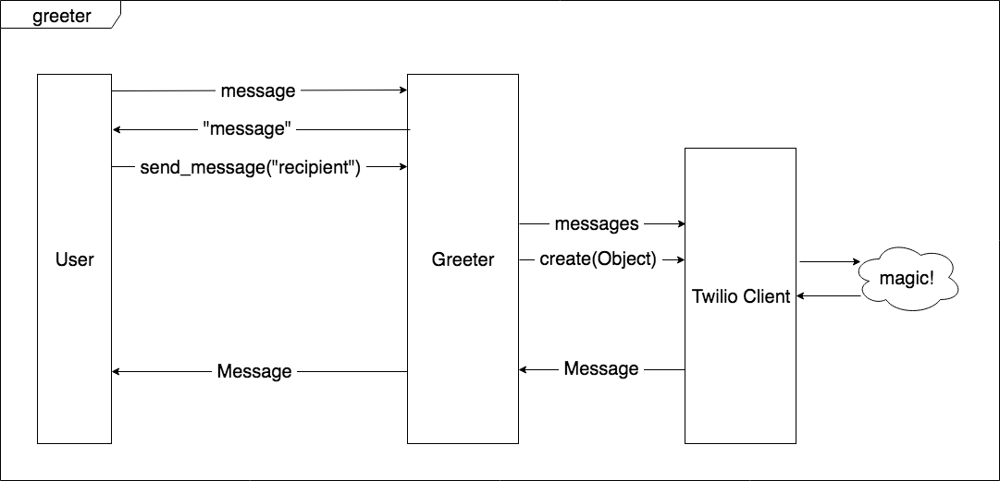

# Mocking External Dependencies

A short exercise to test drive code when you have an external dependency. Build an app that sends a short greeting using the Twilio API.

## User Stories

```
As a caring person,
So that I can show my friend I am thinking about them,
I can send them an automated text message.
```

```
As a caring person,
So that I know what message will be sent,
I can view the message before sending.
```

**Extra information**

The message should read:

```
Have a great day!
```

## Domain Model



## How to use

```
irb
require './lib/greeter.rb'
greeter = Greeter.new
greeter.send_message('+44YOUR_NUMBER')
```


## Instructions

**Clone this repository, then work through these steps to test drive the implementation of Twilio in the Greeter app.**

*To see the example code for each step, checkout the `example-code` branch and select the appropriate commit for the step you want to view.*

1. Write a test for viewing the `message` on the `Greeter` class.

2. Once you have a failing test, use the test fail errors to test drive your development until the test passes.
> Hint: Red, Green, Refactor is a bit of a simplification. Really the TDD process is: reun the test, read the Red error message, write code to fix **only** that error message, run the test again. Repeat until the test turns Green, then Refactor!

3. Write a test for `send_message`, using the domain model as a guide to build your test:
  - The user will call `send_message` on the `Greeter`
  - `send_message` takes a single argument, a recipient phone number in string format.
  - `send_message` should return something called `Message`. This comes from the Twilio client, so use a double here.

4. You should now have a failing test, but it's not quite complete. You'll need to double the Twilio client in order to write the tests we require for TDD. Create a double of the `twilio_client`, update your `Greeter` tests so that this mock is injected into the `Greeter` class (this will break your passing test).

5. Update the `Greeter` class to take the injected `twilio_client`.
>Now you have a `twilio_client` double available, you can write the tests that will drive the development of sending a text message. The domain model indicates that the `Greeter` will call two methods on the `twilio_client`, let's mock these interactions one at a time, using `allow` in Rspec:
```
allow(double).to receive(:method_name).with(args).and_return(return_value)
```

6. Allow the `twilio_client` to receive the `messages` method and return a new double, `messages_client`
>Question: Why does the messages method need to return another double?

7. Allow the `messages_client` to receive the `create` method with an empty hash as the argument, and return the `message` double.

8. You now need to use the Twilio Quickstart guide to identify what keys and values should be put into the hash you are passing to `create`.
>Hint: when building the hash you'll need to include a `from` value, the documentation indicates that this will be set to the phone number provided by Twilio when you signed up for your account. It's a good idea to store this (and your other Twilio details) using Environment Variables, and access it via a constant on the Greeter.
  - To set an environment variable in the command line:
    ```
      export TWILIO_PHONE_NUMBER=yourtwilionumber
    ```
  - To access an environment variable and set to a constant in Greeter:
    ```
      CONFIGURATION = {
        from: ENV['TWILIO_PHONE_NUMBER']
      }
    ```
    Once the configuration constant has been set, you can access this in your tests!

9. Finally, you have a test we can use to implement Twilio integration! Use the error messages from the failing test to test-drive your development to Green.
>You have passing tests, but what will happen when you try to send the message to your number? The tests give us confidence that you are interacting with the Twilio client in line with documentation, so it's time to set up the real thing.

10. Set up the ENV values for the other sensitive data required by the Twilio client (see the Quickstart documentation for more information), and add these to your `Greeter::CONFIGURATION` hash.

11. Now, update your code to use dependency injection to inject the Twilio client, and make sure it is set up using the config as per the documentation.

**Check that your tests still pass, then try sending the greeting message to your own number! (See the `example-code` branch README for an example interaction)**

### Useful links

- [Twilio Quick Start](https://www.twilio.com/docs/sms/quickstart/ruby)
- [Relish documentation on Mocks](https://relishapp.com/rspec/rspec-mocks/v/3-7/docs/basics)
