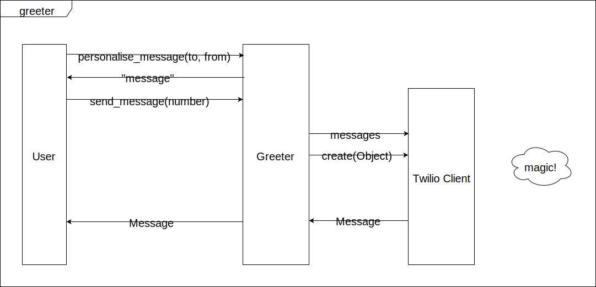

# Mocking External Dependencies

Short exercise to test drive code when you have an external dependency. Build an app that sends a short greeting using the Twilio API.

## User Stories

```
As a caring person,
So that I can show my friend I am thinking about them,
I can send them an automated text message.
```

```
As a caring person,
So that I know what message will be sent,
I can view the message before sending.
```

**Extra information**

The message should read:

```
Have a great day!
```

## Domain Model




## Instructions

Clone this repository, your coach will provide more instructions.


### Useful links

- [Twilio Quick Start](https://www.twilio.com/docs/sms/quickstart/ruby)
